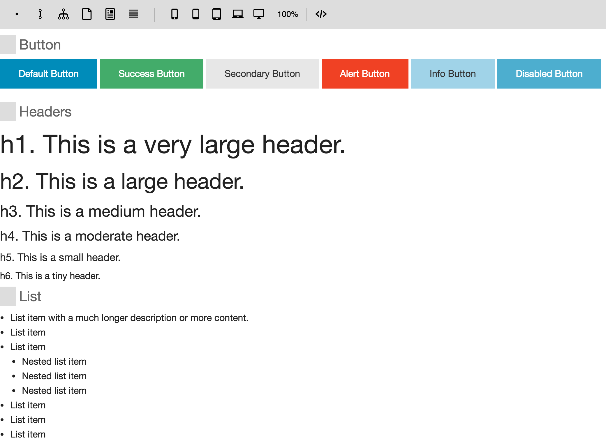
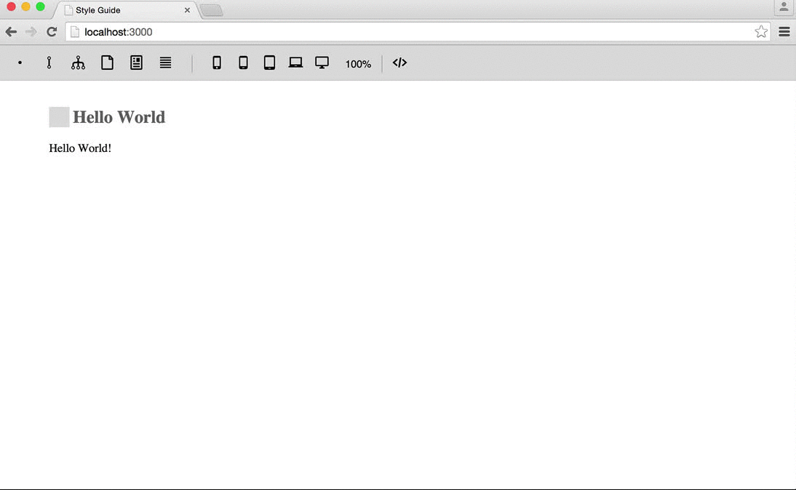

# Component Styleguide

## Introduction

Simple styleguide framework. Use [component-styleguide](https://www.npmjs.com/package/component-styleguide) as a dependency of your styleguide project.

The styleguide is modeled after [http://patternlab.io](http://patternlab.io). This is a simplified Node.js based version, but is fundamentally different.

Since I didn't like the approach of most styleguide tools, I created *Yet Another Styleguide Tool*. Some generate a styleguide from comments in the CSS, but I like to have separate templates, maybe stub data, maybe some JavaScript. Others provide a boilerplate project, which may work fine at first, but it is hard to update the underlying styleguide framework/server later on.

## What is it?

So, this not a boilerplate, you start with a blank project. Only your own templates, styling (and JavaScript) are in your codebase. Just put some templates and CSS in your styleguide or pattern repo, and things are super-easy to run.

Component Styleguide is the underlying framework, for which features can be added or updated, and bugs can be fixed separately. You only need to update the `component-styleguide` dependency (`npm update`), without having to fork a repository and/or merge upstream changes.

The `component-styleguide` is the styleguide server to browse your components (including the viewport resizer). You can use this during development, and/or host it somewhere as a Node service.

See [component-styleguide-example](http://github.com/webpro/component-styleguide-example) for an example setup (you could use this project as a boilerplate), and a [live running example](http://component-styleguide-example.webpro.nl).

## Example Screenshot

## Installation Steps

### 1. Install component-styleguide

    npm install component-styleguide --save

### 2. Structure

Create a directory structure, like this:

    .
    ├── components
    │   ├── atoms
    │   ├── molecules
    │   └── organisms
    └── data

### 3. Start

Write a minimal Node script (say `index.js`):

    var styleguide = require('component-styleguide');
    styleguide();

And run it: `node index.js`.

The styleguide is now running at [http://localhost:3000](http://localhost:3000).

#### 4. Build Components

Put templates and partials in the `atoms`, `molecules`, and `organisms` directories. They should be files ending with `.html` and contain HTML snippets (or actually Handlebars templates).

Here is a screencast of a quick & dirty installation (apologies for bad quality):

## Configuration

You can work with the default settings straight away, but you might want to customize some settings. By default:

* Next to `atoms`, `molecules`, and `organisms`, the `templates` and `pages` directories can be used.
* The extension `html` is expected, but you can configure any other extension.
* If you need stub data to feed to your templates, you can put `*.json` files in the `/data` directory.
* To use your stylesheets, put filenames in the `stylesheets` array, and make sure these files end up in the `/compiled` directory (configurable).
* Idem dito for `scripts`.

To specify alternative settings (showing default values here):

    styleguide({
        components: path.resolve(__dirname, 'components'),
        ext: 'html',
        data: path.resolve(__dirname, 'data'),
        staticLocalDir: path.resolve(__dirname, 'compiled'),
        staticPath: '/compiled',
        stylesheets: [],
        scripts: [],
    });

### Command Line Interface

Alternatively, the styleguide can be started directly from the CLI without any scripting involved:

    styleguide

Here's an example with default settings:

    styleguide --components components --ext html --data data

## Details

### Handlebars

[Handlebars](http://handlebarsjs.com) is used as the template engine.

### Partials

Each template is automatically registered as a partial (e.g. you can reuse your `{{> atoms/component}}` in templates).

### Stub data

All "data" files are concatenated into one "context" for the templates. E.g. `users.json` containing `[]` and `profile.json` containing `{}` will result in context data for the templates:

    {
       "users": [],
       "profile": {}
    }

E.g. the `{{#users}}` collection can now be iterated over in any template.

### CSS & JS

You can organize and compile your CSS and JavaScript in any way you want, as long as they end up in e.g. `/compiled` (the `staticLocalDir`) to serve them with the components. I think it's a good idea to work directly in this folder, or compile SASS/LESS/... source files into e.g. `compiled/stylesheet.css` and configure it as `stylesheets: ['stylesheet.css']`.

## License

[MIT](http://webpro.mit-license.org)
